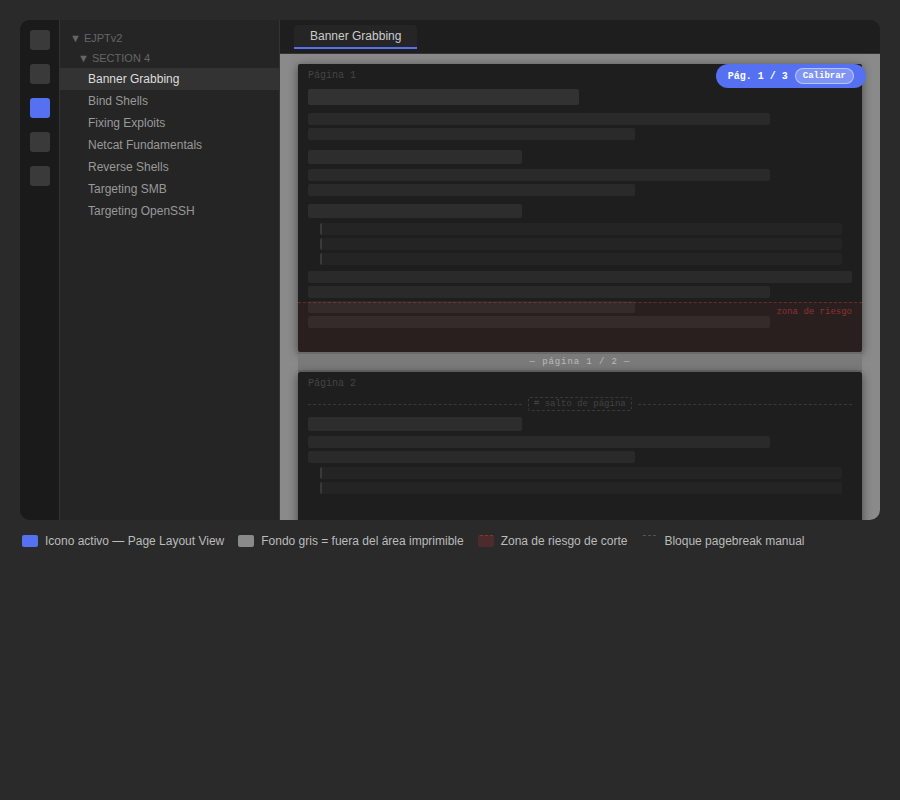
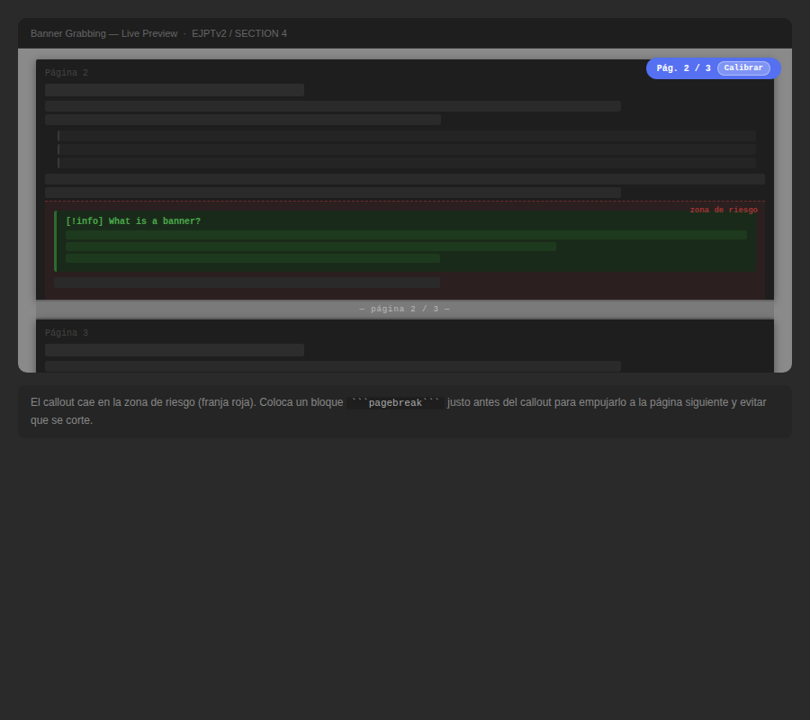
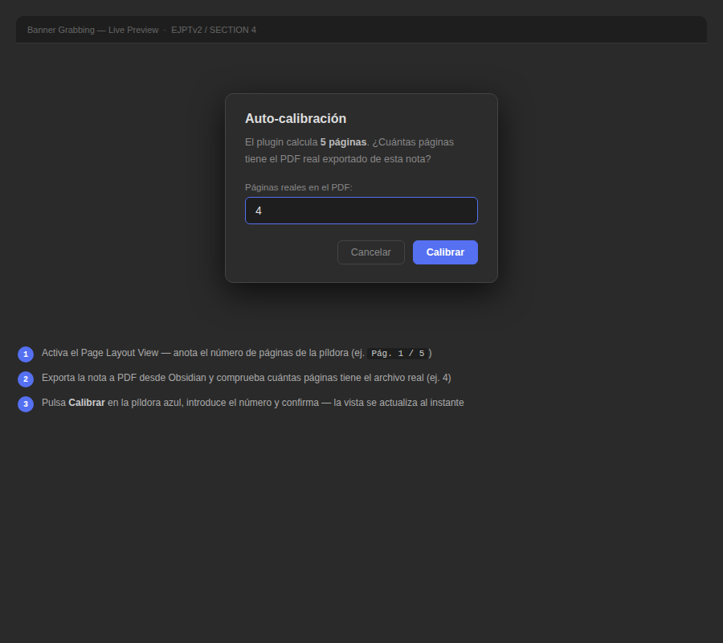

# PDF Page Break — Obsidian Plugin

> Control page breaks and preview page boundaries when exporting your notes to PDF — directly inside Obsidian, without leaving your editor.


> **Note:** The plugin UI is currently in Spanish. English localization is planned.

=======
---

## The problem

When you export a note to PDF in Obsidian, screenshots, code blocks, and tables often get sliced in half across two pages. There's no native way to preview where page breaks will fall or to force a break at a specific point.

## What this plugin does

- **Page Layout View** — Word-style page preview: gray background, white page rectangles, sticky page counter that updates live while you scroll and type. Works in **Live Preview, Source mode, and Reading View**.
- **Manual page breaks** — insert a `\`\`\`pagebreak\`\`\`` block anywhere to force a page break at that exact position when exporting to PDF.
- **Automatic break protection** — prevents images, code blocks, tables, callouts, and headings from being cut in the middle of a page.
- **Auto-calibration** — one-click calibration that calculates the correct scale factor by comparing the plugin's page count with your real exported PDF.

---

## Screenshots

> *Page Layout View active in Live Preview mode. White rectangles represent individual PDF pages. The red tinted zone at the bottom of each page indicates where content risks being cut. The blue pill top-right shows the current page and includes the calibration button.*

> Screenshots are in the `assets/` folder of this repository.







=======

---

## Installation

### Manual

1. Download the latest release zip from the [Releases](../../releases) page.
2. Extract it — you should get a folder called `pdf-page-break` containing `main.js`, `styles.css`, and `manifest.json`.
3. Copy that folder to your vault's plugin directory:
   ```
   <your-vault>/.obsidian/plugins/pdf-page-break/
   ```
4. In Obsidian → **Settings → Community plugins**, disable Safe Mode if prompted, then enable **PDF Page Break**.

### Via BRAT

1. Install the [BRAT plugin](https://github.com/TfTHacker/obsidian42-brat).
2. In BRAT settings, add this repository URL.
3. Enable the plugin in **Settings → Community plugins**.

---

## Usage

### Page Layout View

Click the **📄 icon** in the left ribbon, or open the command palette (`Ctrl/Cmd + P`) and run:

```
PDF Page Break: Toggle Page Layout View
```

Your note switches to a Word-style layout:

| Element | What it means |
|---|---|
| Gray background | Outside the printable area |
| White rectangle | One PDF page |
| `Página X / Y` pill (top right) | Current page — updates live as you scroll and type |
| Red tinted zone (bottom of each page) | Risk zone — content here may get cut |

| `Calibrar` button (inside the pill) | One-click auto-calibration |
=======
| **Calibrar** button (inside the pill) | One-click auto-calibration |


If you switch between Editor and Reading View while the overlay is active, it re-attaches automatically.

### Manual page breaks

Insert a page break at the cursor using the command palette or the **✂️ ribbon icon**. This inserts:

````markdown
```pagebreak
```
````

In Reading View this renders as a subtle dashed line labeled `⌗ salto de página`. When you export to PDF it becomes an actual page break — the dashed line disappears entirely.

### Automatic break protection

By default the plugin injects `page-break-inside: avoid` print CSS rules that prevent the following from being split across pages:

- Images and embedded files
- Code blocks
- Tables
- Callout blocks (`> [!info]`, `> [!warning]`, etc.)
- Headings (kept on the same page as the content that follows them)

All of these can be individually toggled in the plugin settings.

---

## Calibration

The Page Layout View is an approximation — Obsidian's screen renderer and its PDF engine use slightly different scaling. Some plugins (like **make.md**) also modify the editor DOM in ways that can inflate the content height and make the plugin show more pages than the real PDF.

### Auto-calibration (recommended)

1. Enable Page Layout View — note the page count shown in the blue pill (e.g. `Pág. 5 / 5`).
2. Export the same note to PDF and check its real page count (e.g. 4 pages).
3. Click the **Calibrar** button inside the pill.
4. Enter the real page count from the PDF.
5. The plugin calculates and saves the correct scale factor instantly — the overlay updates immediately.

### Manual calibration

Go to **Settings → PDF Page Break → Scale correction factor** and adjust the slider:

- If the gutter appears **too early** (before the actual cut) → increase the value.
- If the gutter appears **too late** (after the actual cut) → decrease the value.

Once calibrated, the value persists across all your notes.

---

## Settings

| Setting | Default | Description |
|---|---|---|
| Page size | A4 | Should match Obsidian's PDF export setting |
| Top margin (mm) | 20 | Should match your PDF export margins |
| Bottom margin (mm) | 20 | Should match your PDF export margins |
| Scale correction factor | 0.90 | Calibration multiplier — use auto-calibration to set this |
| Page separator height (px) | 28 | Thickness of the gray gutter strip between pages |
| Protect images | ✅ | |
| Protect code blocks | ✅ | |
| Protect tables | ✅ | |
| Protect callouts | ✅ | |
| Protect headings | ✅ | |
| Show manual break indicator | ✅ | Show the `⌗` dashed line in the editor |

---

## Commands

| Command | Description |
|---|---|
| `Insert page break` | Inserts a `\`\`\`pagebreak\`\`\`` block at the cursor |
| `Toggle Page Layout View` | Enables or disables the Word-style page preview |
| `Calibrate Page Layout View` | Opens the auto-calibration dialog |

---

## Compatibility

| Environment | Status |
|---|---|
| Live Preview (CodeMirror 6) | ✅ |
| Source mode | ✅ |
| Reading View | ✅ |
| Light theme | ✅ |
| Dark theme | ✅ |
| make.md | ✅ (use auto-calibration) |
| Obsidian 0.15+ | ✅ |
| Mobile | ❌ Desktop only |

---


## Known issues

- **Page count is off with make.md or similar plugins** — these plugins modify the editor DOM and inflate the content height. Use auto-calibration to fix it.
- **Overlay doesn't appear** — make sure you are in Live Preview or Reading View. Some themes that override `position: relative` on the editor container may interfere.

---

## Changelog

### 2.3.1
- Fix: calibration now triggers an immediate synchronous re-render so the overlay updates instantly

### 2.3.0
- Add: auto-calibration modal with one-click scale correction
- Fix: smarter content height measurement, ignores DOM inflation from plugins like make.md

### 2.2.0
- Add: Word-style page layout — white rectangles on gray background
- Add: sticky page indicator pill with live page counter and calibration button

### 2.1.0
- Add: Page Layout View support in Live Preview and Source mode (CodeMirror 6)
- Fix: overlay re-attaches automatically when switching between Editor and Reading View

### 2.0.0
- Add: Page Layout View for Reading View
- Add: configurable margins and scale correction factor
- Add: auto-refresh on mode switch and note change

### 1.0.0
- Add: `pagebreak` code block processor with visual dashed indicator
- Add: automatic print CSS protection for images, code blocks, tables, callouts and headings
- Add: ribbon icons and command palette integration

---

## Contributing

Pull requests and issues are welcome. If you find a case where the page boundaries don't match your PDF output after calibration, please open an issue including:

- Your Obsidian version
- Your OS
- Any plugins that modify the editor (make.md, Kanban, Dataview, etc.)
- The scale correction value you ended up using

This helps improve the default calibration for everyone.

---

## License

MIT — see [LICENSE](LICENSE) for details.

---

*Built to scratch an itch while documenting CTFs and security labs in Obsidian. If it's useful for you too, a star goes a long way ⭐*
=======

